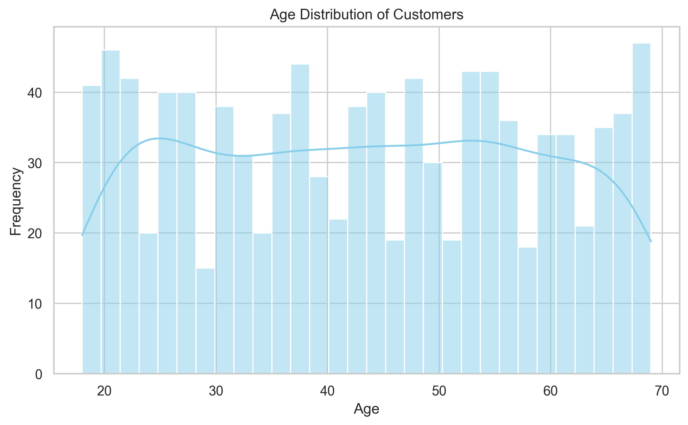
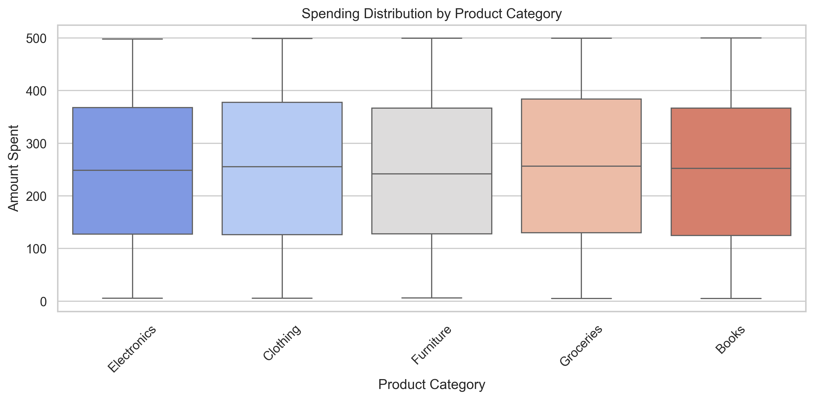
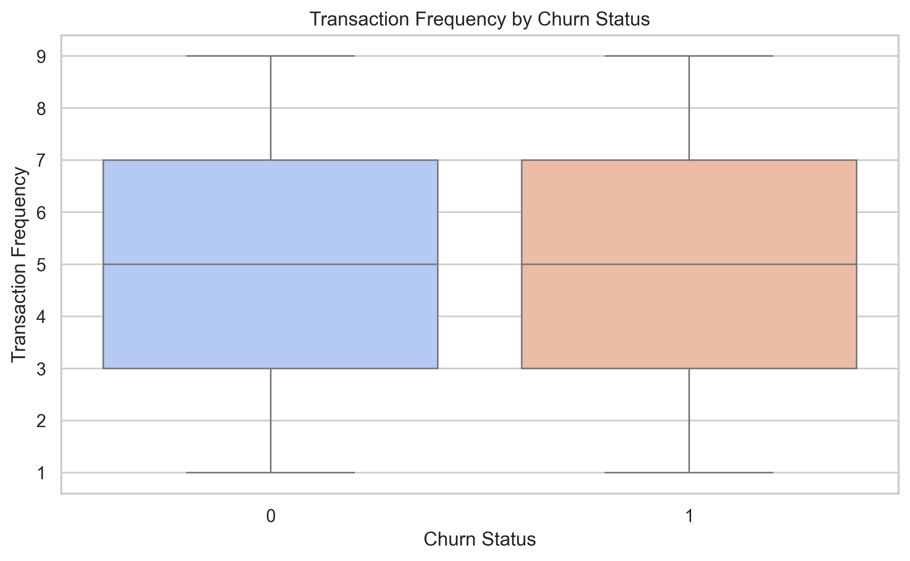
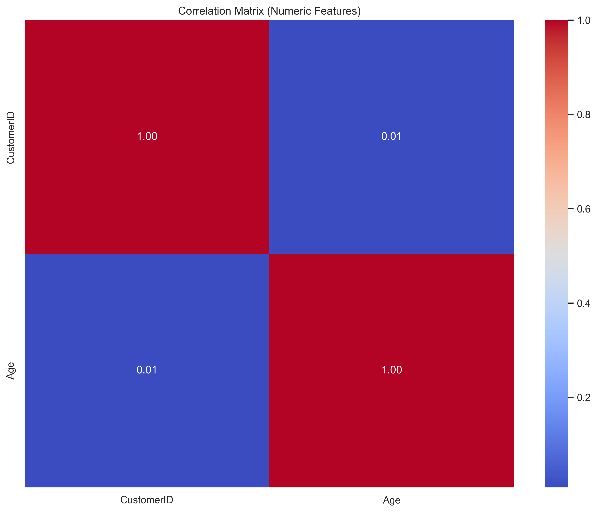

# Customer Churn Analysis

This project builds an end-to-end customer churn analysis and prediction pipeline using Python.  
It combines multiple data sources (demographics, transactions, customer service, online activity, and churn labels) to:

- Explore key drivers of churn.
- Engineer useful features.
- Build and evaluate a Random Forest classification model.
- Generate plots that are saved into an `images/` folder for use in reports and on GitHub.

The analysis is implemented in a single Jupyter notebook:  
`Customer_Churn_Analysis.ipynb`.

---

## 1. Project Overview

Customer churn is a critical problem for subscription and service-based businesses.  
This project answers three main questions:

1. **Who is likely to churn?**  
2. **What customer characteristics and behaviours drive churn?**  
3. **How accurately can we predict churn using a supervised ML model?**

The workflow covers:

- Data loading from multiple Excel files.
- Exploratory Data Analysis (EDA).
- Feature engineering and encoding.
- Data cleaning and preprocessing.
- Model training (Random Forest classifier).
- Model evaluation and interpretation.
- Exporting visualisations to an `images/` folder for reuse.

---

## 2. Data Sources

The analysis uses five related Excel datasets (not included in the repo by default):

1. **Customer Demographics** – `Customer_Churn_Data_Large_CD.xlsx`  
   - Example fields: `CustomerID`, `Age`, `Gender`, `MaritalStatus`, `IncomeLevel`, etc.

2. **Transaction History** – `Customer_Churn_Data_Large_TH.xlsx`  
   - Example fields: `CustomerID`, `TransactionID`, `TransactionDate`, `AmountSpent`, `ProductCategory`, etc.

3. **Customer Service Interactions** – `Customer_Churn_Data_Large_CS.xlsx`  
   - Example fields: `CustomerID`, `InteractionID`, `InteractionType`, `ResolutionStatus`, etc.

4. **Online Activity** – `Customer_Churn_Data_Large_OA.xlsx`  
   - Example fields: `CustomerID`, `LastLoginDate`, `ServiceUsage`, etc.

5. **Churn Labels** – `Customer_Churn_Data_Large_CH.xlsx`  
   - Example fields: `CustomerID`, `ChurnStatus` (0 = Not churned, 1 = Churned).

> Place these files in a suitable folder on your machine and update the file paths in the notebook if needed (see the **Getting Started** section).

---

## 3. Repository Structure

A suggested structure for your GitHub repo:

```text
Customer_Churn_Analysis/
├─ Customer_Churn_Analysis.ipynb        # Main analysis notebook (original or updated)
├─ Customer_Churn_Analysis_updated.ipynb# Updated notebook with image saving
├─ images/                              # Auto-saved plots from the notebook
│  ├─ age_distribution.png
│  ├─ age_by_income_level.png
│  ├─ customers_by_income_level.png
│  ├─ gender_distribution.png
│  ├─ amount_spent_distribution.png
│  ├─ spending_by_product_category.png
│  ├─ age_vs_amount_spent_by_gender.png
│  ├─ age_amount_correlation_matrix.png
│  ├─ amount_spent_by_marital_status.png
│  ├─ age_distribution_by_churn_status.png
│  ├─ churn_by_gender.png
│  ├─ income_level_by_churn_status.png
│  ├─ amount_spent_by_churn_status.png
│  ├─ transaction_frequency_by_churn_status.png
│  ├─ demographics_correlation_matrix.png
│  └─ amount_spent_boxplot_outliers.png
└─ README.md
```

---

## 4. Getting Started

### 4.1. Requirements

Main Python libraries used:

- `pandas`
- `numpy`
- `matplotlib`
- `seaborn`
- `scikit-learn`
- `jupyter` / `notebook`

Install them (for example):

```bash
pip install pandas numpy matplotlib seaborn scikit-learn notebook
```

### 4.2. Project Path & Data Files

On the local machine where this notebook was developed, the project root is:

```text
C:\Projects\Customer_Churn_Analysis
```

The notebook expects the Excel files to be reachable from your current working directory. For portability, you can place all Excel files in a `data/` folder in your project and update the paths in the notebook. Example:

```python
# Example (edit paths as needed)
df_demo = pd.read_excel(r'data/Customer_Churn_Data_Large_CD.xlsx')
df_trans = pd.read_excel(r'data/Customer_Churn_Data_Large_TH.xlsx')
df_cs   = pd.read_excel(r'data/Customer_Churn_Data_Large_CS.xlsx')
df_oa   = pd.read_excel(r'data/Customer_Churn_Data_Large_OA.xlsx')
df_ch   = pd.read_excel(r'data/Customer_Churn_Data_Large_CH.xlsx')
```

### 4.3. Running the Notebook

From the project root (`C:\Projects\Customer_Churn_Analysis` or your chosen folder):

```bash
jupyter notebook
```

Open `Customer_Churn_Analysis_updated.ipynb` and run the cells in order.  
The notebook will automatically create an `images/` folder (if it doesn’t exist) and save plots into it.

---

## 5. Exploratory Data Analysis (EDA)

The EDA section covers:

- **Demographic distributions**
  - Age distribution of customers.
  - Income level and gender distributions.

- **Transaction behaviour**
  - Amount spent distribution.
  - Spending by product category.

- **Relationships and correlations**
  - Age vs. Amount Spent (coloured by gender).
  - Correlation between key numerical variables.

- **Churn-related behaviour**
  - Age vs churn.
  - Gender vs churn.
  - Income level vs churn.
  - Amount spent vs churn.
  - Transaction frequency vs churn.

### 5.1. Example Visualisations (from `images/`)

Once you run the updated notebook, several plots are saved to the `images/` folder. You can embed some key ones in your GitHub README like this:

```markdown
#### Age Distribution of Customers


#### Spending Distribution by Product Category


#### Churn by Gender


#### Transaction Frequency by Churn Status


#### Correlation Matrix (Demographics)


#### Age vs Amount Spent by Gender

```

You can pick whichever plots you feel are most “unique” or insightful for your repo.

---

## 6. Feature Engineering & Preprocessing

Key steps in the notebook:

1. **Merging datasets**  
   All datasets are merged on `CustomerID`:

   ```python
   df = df_demo.merge(df_trans, on='CustomerID', how='left')
   df = df.merge(df_cs, on='CustomerID', how='left')
   df = df.merge(df_oa, on='CustomerID', how='left')
   df = df.merge(df_ch, on='CustomerID', how='left')
   ```

2. **Handling missing values**  
   - Numerical columns: imputed using the mean.
   - Remaining rows with critical missing values: dropped if necessary.

   ```python
   df = df.fillna(df.mean())  # numeric imputation
   df = df.dropna()           # drop rows with remaining NaNs
   final_df = df
   ```

   (Earlier in the notebook, there is also discussion of imputing categorical values like `IncomeLevel` with the most frequent category.)

3. **Encoding categorical variables**  
   Categorical features across the different dataframes are encoded using `pd.get_dummies`, for example:

   ```python
   df_oa = pd.get_dummies(df_oa, columns=['ServiceUsage'], drop_first=True)
   ```

4. **Scaling / transformation**  
   For transaction data, the notebook demonstrates both:

   - Standardisation (Z-score) with `StandardScaler`
   - Normalisation (Min-Max) with `MinMaxScaler`
   - A log-transformed version of `AmountSpent` (to reduce skewness).

   These transformations are used to stabilise variance and make model training more robust.

---

## 7. Model Development

The model used is a **Random Forest Classifier**.

### 7.1. Feature / Target Split

```python
X = df.drop('ChurnStatus', axis=1)
y = df['ChurnStatus']
```

### 7.2. Train–Test Split

```python
from sklearn.model_selection import train_test_split

X_train, X_test, y_train, y_test = train_test_split(
    X, y, test_size=0.2, random_state=42
)
```

### 7.3. Model Training

```python
from sklearn.ensemble import RandomForestClassifier

model = RandomForestClassifier(random_state=42)
model.fit(X_train, y_train)
```

### 7.4. Evaluation

The notebook evaluates both:

- **Test data performance**

  ```python
  from sklearn.metrics import accuracy_score, classification_report

  y_pred = model.predict(X_test)
  accuracy = accuracy_score(y_test, y_pred)
  print(f"test_Accuracy: {accuracy}")
  print("Classification Report:")
  print(classification_report(y_test, y_pred))
  ```

- **Training data performance**

  ```python
  y_train_pred = model.predict(X_train)
  train_accuracy = accuracy_score(y_train, y_train_pred)
  print(f"Training Accuracy: {train_accuracy}")
  print("Training Classification Report:")
  print(classification_report(y_train, y_train_pred))
  ```

---

## 8. Model Performance Summary

From the report section in the notebook:

- **Model**: Random Forest Classifier  
- **Example training metrics** (illustrative from your summary):

  - Training accuracy around **0.9875**.
  - For the churn class (1):
    - High precision (~1.00).
    - Strong recall (around 0.93).
    - F1-score around 0.97.

- The model shows:

  - Very high overall accuracy.
  - Excellent ability to detect churners (class 1) with strong F1-score.
  - Minimal false positives, meaning retention efforts are more targeted.

These results are discussed in the notebook in terms of:

- Strengths of the model.
- Slight overfitting risk (training vs test comparison).
- Business implications for retention strategies.

---

## 9. How Images Are Saved (Important for GitHub)

The updated notebook defines an `IMAGES_DIR` at the top:

```python
import os

# Create images directory relative to the project root
IMAGES_DIR = os.path.join(os.getcwd(), "images")
os.makedirs(IMAGES_DIR, exist_ok=True)
```

For each key plot, code like this has been added before `plt.show()`:

```python
plt.tight_layout()
plt.savefig(os.path.join(IMAGES_DIR, "age_distribution.png"), bbox_inches="tight")
plt.show()
```

This means:

- When you run the notebook from your project root, all images automatically appear in the `images/` folder.
- You can directly reference them in this `README.md`.

---

## 10. Future Improvements

Possible extensions:

- Hyperparameter tuning for the Random Forest (e.g., GridSearchCV).
- Feature importance visualisation and SHAP analysis.
- Handling class imbalance with techniques such as SMOTE or class weights.
- Building alternative models (XGBoost, LightGBM, Logistic Regression) for comparison.
- Packaging code into reusable Python modules and adding unit tests.

---

## 11. Acknowledgements

- Data: Synthetic/organisational customer churn dataset (`Customer_Churn_Data_Large_*.xlsx` series).
- Author: Ahmed Kansulum Mohammed (Hexatech Solutions / Tech Dynamics Integrated).
